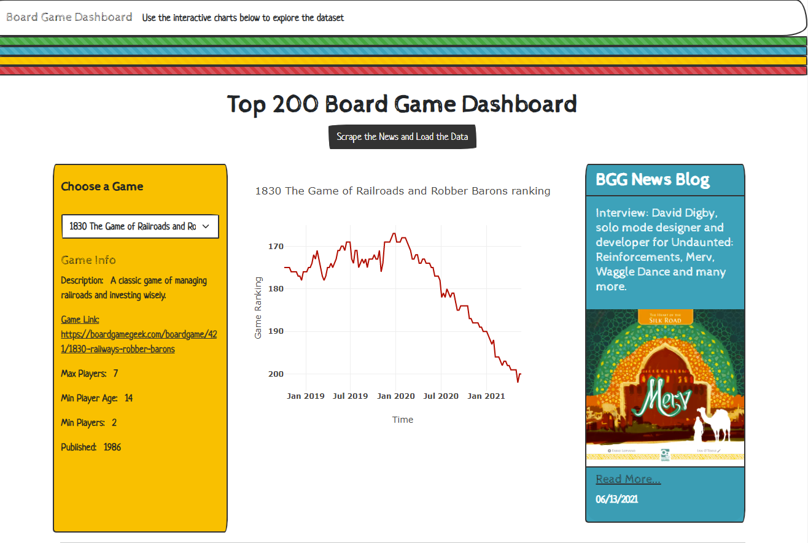
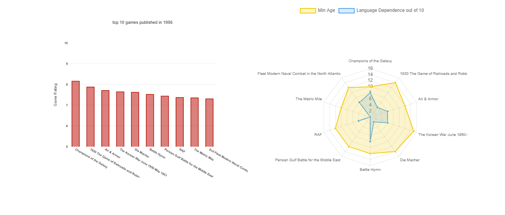
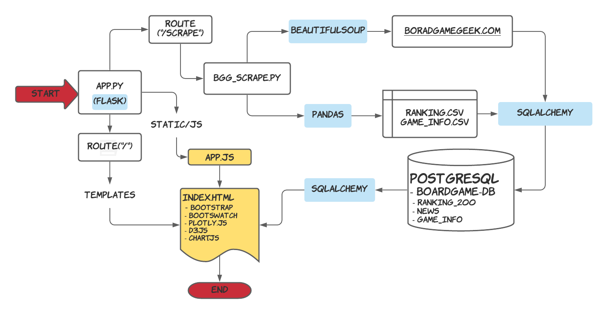

## Rationale
BoardGameGeek is a valuable resource for boardgame information. We built a webpage to visualize the data related to board games. 

## Functionality
The index.html page will load with 

1. The latest Board Gaming News scrapped from boardgamegeek.com is loaded on a card on the right side of the HTML. It has the news title, image, link, and time information. Click the “Read More…” link to read the entire article.

2. The "scrape the news and load the data" button will scrape the load the most up-to-date data.

3. A user can choose a game from dropdown menu which consists games that made into the top 200 game list in the past 2.5 years. 

4. -  The game information board will load a brief description of the game, a minimum/maximum number of players, game link (functional), minimum ages of players, etc. 
   -  The game ranking over time is shown on a line plot. A red line shows the game is currently trending downward, while a green line shows it is trending upward.
   -  Based on the year of publishing of the selected game, the web page loads a bar graph with the top ten games with their average rankings. 
   -  The minimum age requirement and language dependence (out of 10) were plotted on a radar chart. 
   -  Finally, there is the bubble plot. It shows all the games published in the same year as the selected game. The x-axis represents the number of play counts from the website members, and the y-axis is the rating. A tooltip shows the game name, min playtime, and min number of players. The color of the bubble is based on the number of players (1,2,3-4,4+ => green, blue, yellow, red). The size of the bubble is based on the minimum playtime required.
   -  All columns of contents are responsive based on the size of the screen thanks to bootstrape. The line graph will shift to second row on a medium screen size, and the news will be the fist row when user load the page on a mobile device.

 
One has to install PostgreSQL to use this flask-driven web scrapping. A database called boardgame_db has to be created to communicate with the flask. After that is done, run the app.py file and load the page to your local server. The App.py has two routes, the scrape route calls bgg_scrape.py to get news from boardgamegeek.com and clean & changes the CSVs to load to PostgreSQL under database boradgame_db into three tables. The main route takes the data from the database and load to html with app.js to visualize and build the page.

The bgg_csv folder contains all the game data available from Kaggle (see reference).

In the without_flask folder, the HTML page was loaded information from three JSON files which are the output of scrape the boardgamegeek website and convert the CSVs to JSON file.

## References

- BoardGameGeek
- Kaggle 20,000 Boardgames Dataset
- Kaggle Board Game Geek Rankings
